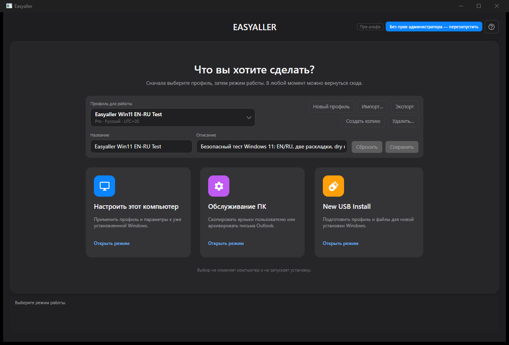
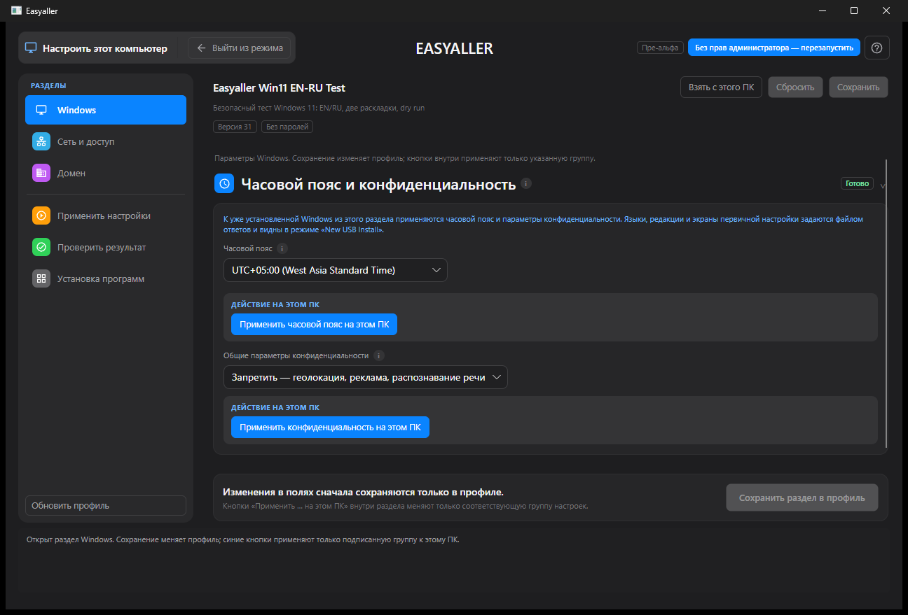
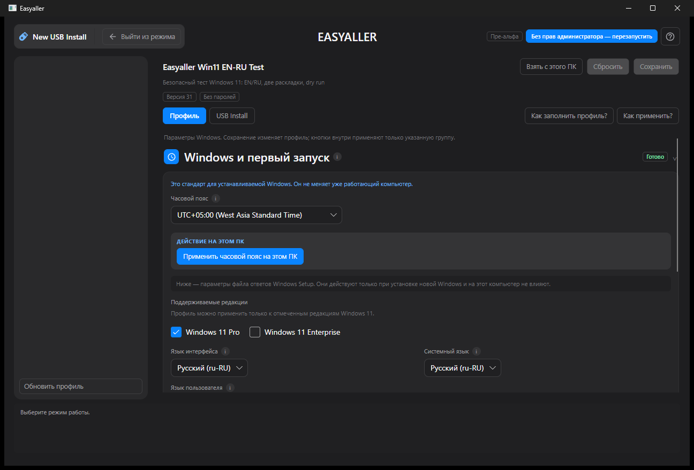

# Easyaller

Easyaller is an open-source Windows workstation provisioning and maintenance application. It turns repeatable support work into validated profiles and explicit operator workflows while keeping credentials, local installers, deployment media, and organization-specific data out of Git.

> Status: pre-alpha, actively tested on Windows 11. The start screen, profile manager, selective live-PC configuration, compliance checks, application queue, deployment-package export, protected USB workflow, desktop-shortcut maintenance, and classic Outlook PST archiving are implemented. Use a test workstation or VM before production rollout.



| Configure this PC | New Windows preparation |
| --- | --- |
|  |  |

## Why it exists

Preparing a workstation usually combines many error-prone manual actions: naming the PC, configuring networking and DNS, applying a time zone and privacy settings, joining a domain, installing applications in order, copying shortcuts, and cleaning up Outlook mailboxes. Easyaller provides one auditable desktop workflow for those tasks.

The application separates three concerns:

1. **Reusable profiles** describe the intended workstation state.
2. **Runtime inputs** provide machine-specific values and credentials only when an action needs them.
3. **PC maintenance tools** perform standalone support operations that do not belong to a new-Windows profile.

Easyaller opens on a dedicated start screen. Select and manage the profile there, then enter one of the three operating modes. Every mode has a visible **Exit mode** action that returns to the start screen without closing the application.

## Current workflows

### Configure this PC

- Apply only settings that are explicitly present and selected; empty runtime fields do not erase existing Windows values.
- Set the Windows time zone on the current computer.
- Rename the computer with the validated organization naming format.
- Configure static IPv4, subnet mask, gateway, and up to three DNS servers on an explicitly selected adapter.
- Configure WinHTTP proxy and bypass values.
- Join a Windows domain with credentials held only in memory for the current operation.
- Apply supported Windows 11 privacy policies.
- Install applications in a user-defined queue, with move-up and move-down controls.
- Resume multi-step provisioning after a required restart.
- Compare the current computer with a selected profile and save a readable compliance report.

Every live-PC action is confirmed, reports its result, and skips values that already match.

### Profiles

- Select and manage profiles only from the start screen, so the active profile cannot change unexpectedly during an operation.
- Create, clone, rename, describe, reset, delete, import, and export versioned `*.wpprofile.json` profiles.
- Store complete reusable workstation configuration without passwords or tokens.
- Validate schema versions, duplicate JSON keys, unknown properties, network values, computer names, package paths, and secret-like fields.
- Save atomically with revision-conflict detection, recoverable backups, and corrupted-file isolation.
- Embed one selected profile into a self-contained release executable for offline workstation preparation.

Local profiles are stored under `%LOCALAPPDATA%\Easyaller\Profiles`. Older machine-wide profiles are migrated from `%ProgramData%\Easyaller\Profiles` when possible.

### Prepare Windows

- Validate supported Windows 11 Pro and Enterprise amd64 targets.
- Inspect an administrator-supplied ISO without downloading Windows.
- Generate deterministic `autounattend.xml` using documented Windows Setup settings.
- Preview the effective configuration and generated XML before writing files.
- Export a hash-verified deployment package through a sibling staging directory and atomic finalization.
- Deliver the Easyaller payload, selected profile, manifests, scripts, and explicitly included installers through the configuration-set layout.
- Create a protected installation USB workflow for an already empty, preformatted removable volume.

Easyaller does not automatically select or partition an internal disk.

### Maintain an existing PC

Maintenance operations are separate from provisioning profiles and run only when the operator requests them.

#### Copy desktop shortcuts

- Select a local Windows user.
- Select a source directory containing `.lnk`, `.url`, or `.website` files.
- Preview the exact shortcut list.
- Skip or replace name conflicts.
- Copy to the selected user's desktop after confirmation.
- Remember the source directory between launches and clear it automatically when the directory disappears.
- Report a clear administrator-rights error instead of crashing when Windows denies access to another user's profile.

#### Archive classic Outlook mail

- Use the current signed-in user's classic Microsoft Outlook profile.
- Archive the standard Inbox and Sent Items folders.
- Select all time, older than two weeks, one month, or three months.
- Count matching messages before changing Outlook.
- Create or reuse `%USERPROFILE%\Documents\Файлы Outlook\dd.MM.yyyy.pst`.
- Display the PST in Outlook as `dd.MM.yyyy`.
- Create `Входящие` and `Отправленные` directly in the PST root and move messages into the matching archive folder.
- Show per-folder and overall progress, moved-message counts, and failures.
- Block duplicate clicks, require a fresh preview after completion, and prevent Easyaller from closing during a transfer.

The Outlook workflow uses the classic Outlook COM object model. The new Outlook client is not supported.

## Safety model

- Passwords, tokens, and domain credentials are never profile fields.
- Runtime credentials remain in memory only for the current operation.
- Imported JSON is treated as untrusted input.
- Application paths are constrained to the deployment package; absolute paths and traversal are rejected.
- Profiles, proprietary installers, release executables, ISO files, VM disks, and generated deployment packages are ignored by Git.
- Actions that change Windows, another user's desktop, removable media, or Outlook require explicit confirmation.
- USB creation never chooses a target automatically and rechecks immutable disk identity before writing.
- Outlook archiving requires a current preview and cannot run twice concurrently.

## Architecture

```text
src/
  Easyaller.App/           Avalonia desktop UI and Windows adapters
  Easyaller.Core/          Profiles, validation, storage, planning, journals
  Easyaller.Deployment/    Unattend, packages, USB and Windows deployment logic
tests/
  Easyaller.Core.Tests/    Unit and integration-oriented service tests
tools/
  Easyaller.IsoPackageBuilder/
scripts/
  New-EasyallerWindowsIso.ps1
schemas/
  provisioning-profile.schema.json
```

## Build and test

Prerequisite: .NET SDK 10.

```powershell
dotnet build Easyaller.slnx
dotnet test Easyaller.slnx --no-build
dotnet run --project src/Easyaller.App/Easyaller.App.csproj
```

The current suite contains 290 tests covering profile validation and persistence, provisioning plans and execution, deployment export, application installation queues, USB safety, shortcut copying, maintenance settings, and Outlook archive-period rules.

### Publish one self-contained EXE

```powershell
dotnet publish src/Easyaller.App/Easyaller.App.csproj `
  -c Release -r win-x64 --self-contained true `
  -p:PublishSingleFile=true `
  -p:IncludeNativeLibrariesForSelfExtract=true
```

To embed a local profile, pass `-p:EmbeddedProfilePath=C:\path\profile.wpprofile.json`. Never commit that profile when it contains organization-specific configuration.

### Create a data-only ISO

Place the self-contained `Easyaller.App.exe` in an otherwise empty media directory, then run:

```powershell
powershell -ExecutionPolicy Bypass -File scripts/New-EasyallerWindowsIso.ps1 `
  -SourceDirectory C:\path\iso-root `
  -DestinationIso C:\path\Easyaller.iso `
  -VolumeLabel EASYALLER `
  -DataOnly
```

## Documentation

- [Getting started](docs/GETTING_STARTED.md) · [Русская инструкция](docs/GETTING_STARTED_RU.md)
- [Deployment operations](docs/DEPLOYMENT_OPERATIONS.md) · [RU](docs/DEPLOYMENT_OPERATIONS_RU.md)
- [Runtime provisioning](docs/PROVISIONING_EXECUTION.md) · [RU](docs/PROVISIONING_EXECUTION_RU.md)
- [Deployment packages](docs/DEPLOYMENT_PACKAGE.md) · [RU](docs/DEPLOYMENT_PACKAGE_RU.md)
- [Static IPv4 and DNS](docs/STATIC_IPV4_DNS.md) · [RU](docs/STATIC_IPV4_DNS_RU.md)
- [USB creator](docs/USB_CREATOR.md) · [RU](docs/USB_CREATOR_RU.md)
- [Windows SIM validation](docs/WINDOWS_SIM_VALIDATION.md) · [RU](docs/WINDOWS_SIM_VALIDATION_RU.md)
- [Product specification](PRODUCT_SPEC.md)

## Project boundaries

Easyaller is not a fleet-management platform, an ISO downloader, a credential vault, or an automatic internal-disk partitioner. Organization profiles and licensed application installers remain private deployment assets.

## Contributing and security

See [CONTRIBUTING.md](CONTRIBUTING.md) for development expectations and [SECURITY.md](SECURITY.md) for private vulnerability reporting.

## License

[MIT](LICENSE)
